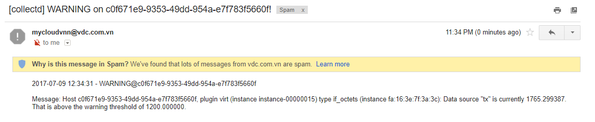

# Hướng dẫn thiết lập cảnh báo cho VM

## 1. Mô tả

- Hướng dẫn sử dụng collectd để gửi cảnh báo qua email cho admin khi metric của VM đạt ngưỡng đặt trước.
- Phiên bản OS sử dụng là Ubuntu 14.04.5, kernel 4.4.0-79-generic.
- Phiên bản collectd sử dụng là collectd 5.5.3.1.

## 2 Cách cấu hình
Sử dụng 4 plugin có sẵn của collectd:
 - [virt](plugins/virt_plugin.md): thu thập metric VM
 - [threshold](plugins/threshold_plugin.md): Đặt ngưỡng cảnh báo
 - [notify_email](plugins/notify_email_plugin.md): gửi cảnh báo qua email
 - [syslog](plugins/syslog_plugin.md): ghi log khi có cảnh báo

## 2.1. Trên host Compute, sửa file `/etc/collectd/collectd.conf`

```sh
FQDNLookup true
LoadPlugin threshold
LoadPlugin virt
LoadPlugin notify_email
LoadPlugin syslog
LoadPlugin network

# Khai báo ngưỡng cảnh báo cho metric if_octets_tx (băng thông ra của interface) của VM, đơn vị là bits
<Plugin "threshold">
<Plugin "virt">
        <Type "if_octets">
         DataSource "tx"
         WarningMin 100
         WarningMax 1200
       </Type>
</Plugin>

</Plugin>

# Khai báo địa chỉ email nhận cảnh báo
<Plugin "notify_email">
 From "notify_email@email.com"
 Recipient "receiver@email.com"
 SMTPServer "smtp.notification.com"
 SMTPUser "notify_email"
 SMTPPort "25"
 Subject "[collectd] %s on %s!"
 SMTPPassword "notify_email_password"
</Plugin>


# Khai báo syslog plugin
LoadPlugin syslog
<Plugin syslog>
LogLevel warning
NotifyLevel WARNING
</Plugin>


# Khai báo plugin virt
<Plugin virt>
    RefreshInterval 120
    Connection "qemu:///system"
    HostnameFormat "uuid"
    InterfaceFormat "address"
</Plugin>

<Plugin network>
    Server "Graphite_IP" "2003"
</Plugin>

```

## 2.2. Khởi động lại collectd
`service collectd restart`

## 2.3. Đẩy tải trên VM 
`root@u1:~# ping 8.8.8.8 -s 500`

## 2.4. Trên host compute, kiểm tra cảnh báo
- Kiểm tra trong /var/log/syslog
```
4,3,Jul 10 03:15:30,compute1,collectd[5952]:, Notification: severity = WARNING, host = c0f671e9-9353-49dd-954a-e7f783f5660f, plugin = virt, plugin_instance = instance-00000015, type = if_octets, type_instance = fa:16:3e:7f:3a:3c, message = Host c0f671e9-9353-49dd-954a-e7f783f5660f, plugin virt (instance instance-00000015) type if_octets (instance fa:16:3e:7f:3a:3c): Data source "tx" is currently 1374.393586. That is above the warning threshold of 1200.000000.

6,3,Jul  9 21:56:35,compute1,collectd[29195]:, notify_email: notify sent to receiver@email.com: 250 Ok
```

- Kiểm tra email cảnh báo


