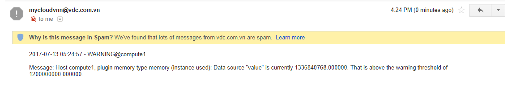

# Hướng dẫn thiết lập cảnh báo

## 1. Mô tả

- Hướng dẫn sử dụng collectd để gửi cảnh báo qua email cho admin khi một metric đạt ngưỡng đặt trước.
- Phiên bản OS sử dụng là Ubuntu 14.04.5, kernel 4.4.0-79-generic.
- Phiên bản collectd sử dụng là collectd 5.5.3.1.

**Lưu ý: Hiện collectd chỉ gửi mail được với các SMTP Server sử dụng port 25, không sử dụng được với Gmail SMTP Server**


## 2 Cách cấu hình
Sử dụng 4 plugin có sẵn của collectd:
 - memory: thu thập thông số RAM của host vật lý
 - [threshold](plugins/threshold_plugin.md): Đặt ngưỡng cảnh báo
 - [notify_email](plugins/notify_email_plugin.md): gửi cảnh báo qua email
 - [syslog](plugins/syslog_plugin.md): ghi log khi có cảnh báo

## 2.1. Trên host Compute, sửa file `/etc/collectd/collectd.conf`

```sh
FQDNLookup true
LoadPlugin threshold
LoadPlugin notify_email
LoadPlugin syslog
LoadPlugin network
LoadPlugin memory

# Khai báo ngưỡng cảnh báo cho metric memory_used của host compute1, đơn vị là bytes
<Plugin "threshold"> 
    <Host "compute1">
        <Plugin "memory">
            <Type "memory">
                Instance "used"
                WarningMin 100000000
                WarningMax 1200000000
            </Type>
        </Plugin>
    </Host>
</Plugin>

# Khai báo địa chỉ email nhận cảnh báo
<Plugin "notify_email">
 From "mycloudvnn@vdc.com.vn"
 Recipient "zabbix.vdcit@gmail.com"
 SMTPServer "smtp1.vdc.com.vn"
 SMTPUser "mycloudvnn"
 SMTPPort "25"
 Subject "[collectd] %s on %s!"
 SMTPPassword "abcxyz"
</Plugin>

# Khai báo syslog plugin
LoadPlugin syslog
<Plugin syslog>
LogLevel warning
NotifyLevel WARNING
</Plugin>

<Plugin network>
    Server "Graphite_IP" "2003"
</Plugin>

```

## 2.2. Khởi động lại collectd
`service collectd restart`

## 2.3. Đẩy tải trên VM 
`root@u1:~# ping 8.8.8.8 -s 500`

## 2.4. Trên host compute, kiểm tra cảnh báo
- Kiểm tra trong /var/log/syslog
```
4,3,Jul 13 05:24:57,compute1,collectd[13655]:, Notification: severity = WARNING, host = compute1, plugin = memory, type = memory, type_instance = used, message = Host compute1, plugin memory type memory (instance used): Data source "value" is currently 1335840768.000000. That is above the warning threshold of 1200000000.000000.
4,1,Jul 13 05:24:57,compute1,collectd, warning: Host compute1, plugin memory type memory (instance used): Data source "value" is currently 1335840768.000000. That is above the warning threshold of 1200000000.000000.

6,3,Jul 10 03:15:30,compute1,collectd[5952]:, notify_email: notify sent to zabbix.vdcit@gmail.com: 250 Ok
```

- Kiểm tra email cảnh báo


