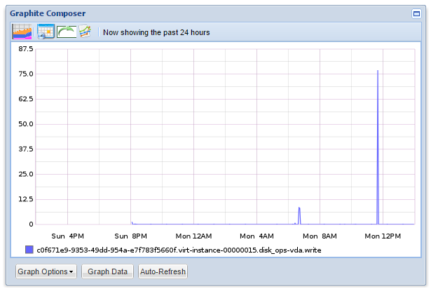
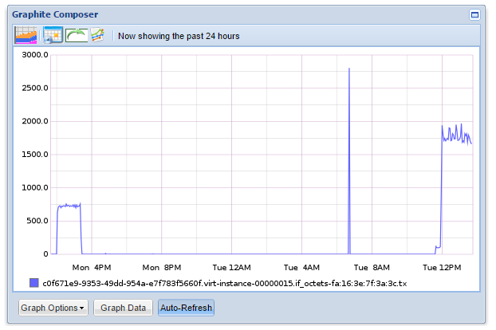
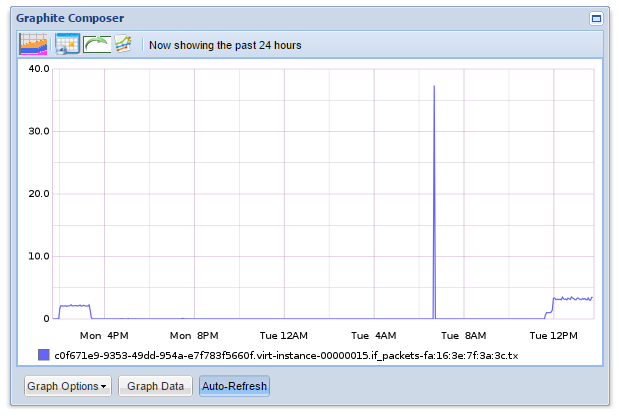
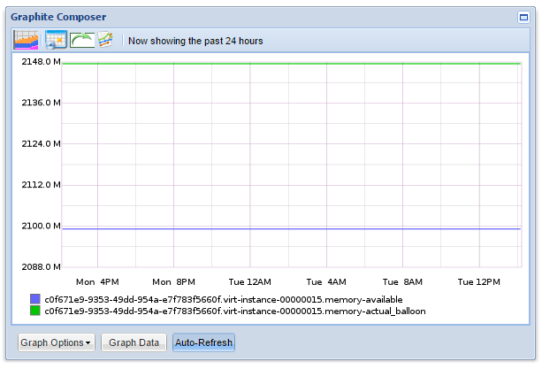
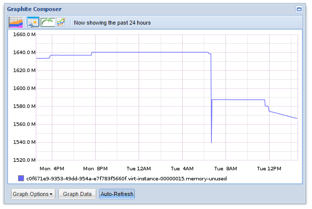
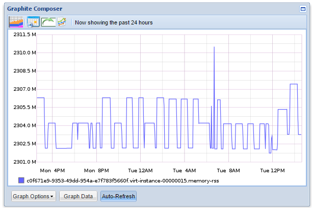
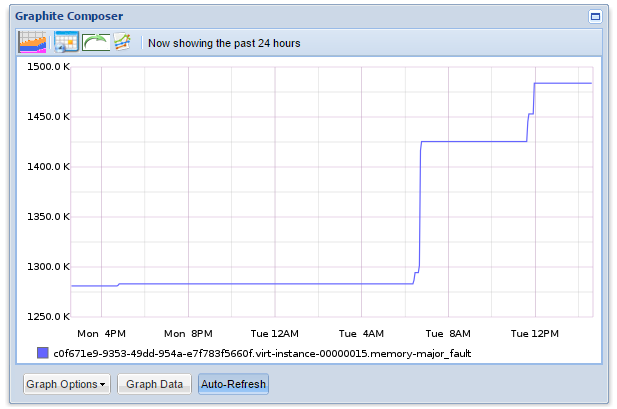
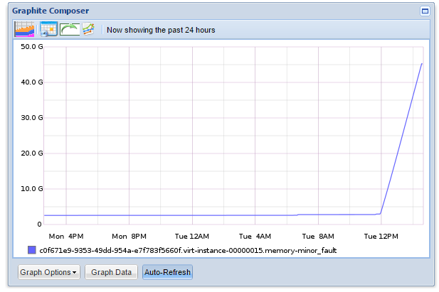

# Plugin Notify email

## 1. Mô tả

Plugin libvirt cho phép thu thập trạng thái của CPU, disk và network của máy ảo mà không cần cài agent lên trên các máy ảo đó - chỉ cần collectd trên máy chủ host. Các metric được thu thập thông qua libvirt API.


## 2 Cách cấu hình

```sh
<Plugin "libivrt">
RefreshInterval 120
Connection "qemu:///system"
Domain "longlq_vm"
BlockDevice "/:hdb/"
InterfaceDevice "/:eth0/"
IgnoreSelected "true"
BlockDeviceFormat "target"
HostnameFormat "uuid"
InterfaceFormat "address"
PluginInstanceFormat name
</Plugin>
```

**Các tùy chọn khi cấu hình:**

 `Connection "qemu:///system"`:

  Kết nối tới hypervisor thông qua uri, trong VD là kết nối tới hypervisor nằm chính trên host
 
 `RefreshInterval 120`:

  Khoảng thời gian để lấy dữ liệu của domain và device (được tính bằng giây). Nếu set là 0 thì sẽ disable tùy chọn này.
 
 `Domain "longlq_vm"`:

  Đưa máy ảo longlq_vm vào danh sách

 `BlockDevice "/:hdb/"`:

  Đưa thiết bị hdb trên tất cả các máy ảo vào danh sách các block device (các ổ cứng, CD-ROM)

 `InterfaceDevice "/:eth0/":

  Đưa thiết bị eth0 trên tất cả các máy ảo danh sách các interface device (các card mạng)

 `IgnoreSelected "true"`:

  Nếu chọn `false`, hệ thống sẽ chỉ lấy thông số của các máy ảo, block device và interface device trong danh sách và bỏ qua tất cả các máy ảo và thông số khác. Nếu chọn `true`, hệ thống sẽ lấy thông số của tất cả các máy ảo và device ngoài danh sách.

 `BlockDeviceFormat "target"`:

  Khai báo mặc định là `target`, tên của thiết bị block device trên máy ảo sẽ được lấy theo name được nhìn trong máy ảo, VD: sda. Nếu chuyển thành `source`, tên block device sẽ được lấy dựa trên đường dẫn file block device đó trên host, VD: var_lib_libvirt_images_image1.qcow2

 `HostnameFormat "uuid"`:

  - Khai báo mặc định là `name`: tên máy ảo trên collectd sẽ lấy tên máy ảo trên hypervisor
  - Khai báo là `uuid`: tên máy ảo trên collectd sẽ lấy uuid của máy ảo trên hypervisor
  - Khai báo là `hostname`: tên máy ảo trên collectd sẽ lấy hostname của host chứa máy ảo

 `InterfaceFormat "address"`
  - Khai báo mặc định là `name`: tên của interface trên collectd sẽ lấy theo tên interface trong máy ảo
  - Khai báo là `address`: tên của interface trên collectd sẽ lấy theo MAC của interface trong máy ảo

   `PluginInstanceFormat name|uuid|none`
  - Plugin virt sẽ thu thập các metric và đặt plugin_instance của metric theo giá trị được gán.
  - `name`: sử dụng tên của máy ảo.
  - `uuid`: sử dụng uuid của máy ảo
  - Mặc định sẽ không gán giá trị cho plugin_instance
  - Có thể sử dụng cả 2 giá trị `name uuid`, khi đó plugin_instance sẽ được gán them name và uuid của máy ảo, cách nhau bởi ":"

## 3. Các metric của máy ảo

### 3.1.Thông số về disk
 - `Disk Octet`: Thể hiện số Bytes/s được đọc hoặc ghi vào ổ cứng
 

 - `Disk Ops`: Thể hiện sô IOPS đọc hoặc ghi vào ổ cứng
 
 
  Các thông số trên có thể liệt kê bằng lệnh: (thực hiện trên host compute chứa máy ảo)
  ```
  #virsh domblkstat instance-00000015 vda
  ```
  Với `instance-00000015 vda` là tên máy ảo trên host compute

  Kết quả: 

  ```
  vda rd_req 17940
  vda rd_bytes 349932544
  vda wr_req 4903
  vda wr_bytes 633525248
  vda flush_operations 548
  vda rd_total_times 21134039630
  vda wr_total_times 109031753668
  vda flush_total_times 1650339171
  ```

  Hoặc sử dụng lệnh:
  ```
  #virsh domblkstat instance-00000015 vda --human
  ```

  Kết quả:

  ```
  Device: vda
  number of read operations:      17940
  number of bytes read:           349932544
  number of write operations:     4903
  number of bytes written:        633525248
  number of flush operations:     548
  total duration of reads (ns):   21134039630
  total duration of writes (ns):  109031753668
  total duration of flushes (ns): 1650339171
  ```

### 3.2. Thông số của network
 - `Interface octets`: Thể hiện số Bytes/s đi vào hoặc ra card mạng
 

 - `Interface packets`:Thể hiện số packets/s đi vào hoặc ra card mạng
 

 Các thông số trên có thể liệt kê bằng lệnh: (thực hiện trên host compute chứa máy ảo)

 ```
 #virsh domifstat instance-00000015 tapbc55e0b5-1e
 ```

 Kết quả:

 ```
 tapbc55e0b5-1e rx_bytes 15556653
 tapbc55e0b5-1e rx_packets 35757
 tapbc55e0b5-1e rx_errs 0
 tapbc55e0b5-1e rx_drop 0
 tapbc55e0b5-1e tx_bytes 15429686
 tapbc55e0b5-1e tx_packets 39541
 tapbc55e0b5-1e tx_errs 0
 tapbc55e0b5-1e tx_drop 0
 ```
### 3.3. Thông số của cpu

### 3.4. Thông số của RAM
 - `Memory available`: Thể hiện lượng RAM được cấp phát lý thuyết cho máy ảo
 

 - `Memory actual balloon`: Thể hiện lượng RAM được câps phát thực tế cho máy ảo
 

 - `Memory unused`: Thể hiện lượng RAM chưa sử dụng tới
 

- `Memory rss`: Thể hiện lượng RAM phân bổ cho process VM


- `Memory major fault`: Thể hiện số page fault được gọi từ disk


- `Memory minor fault`: Thể hiện số page fault được gọi từ buffer cache


Các thông số trên có thể liệt kê bằng lệnh: (thực hiện trên host compute chứa máy ảo)

```
#virsh dommemstat instance-00000015
```

Kết quả:

```
actual 2097152
swap_in 0
swap_out 0
major_fault 1449
minor_fault 36510659
unused 1531360
available 2049980
rss 2253348
```

```
#virsh domstats --balloon instance-00000015
```

Kết quả:

```
Domain: 'instance-00000015'
balloon.current=2097152
balloon.maximum=2097152
```

Tham khảo:

[1] - https://www.mankier.com/1/virsh

[2] - https://collectd.org/documentation/manpages/collectd.conf.5.shtml#plugin_virt
